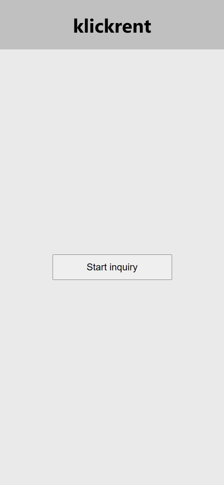

# Machine finder

**Example React App with list of data**

This project was bootstrapped with [Create React App](https://github.com/facebook/create-react-app).

---

### ☑️ Requirements

Latest LTS version of [Node.js](https://nodejs.org)

### 🔨 Installation

Just clone this repo, go to the project directory and type in command line:

`npm install`

### ⚙️ Running (development)

To start application type:

`npm start`

Application will be run on port 3000. To display website go to:

[localhost:3000](localhost:3000)

### 🧪 Testing

To check available tests type:

`npm test`

### 📦 Deployment

To build app and host on GitHub Pages type:

`npm run deploy`
